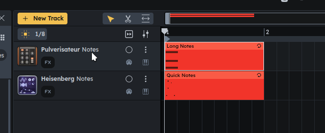
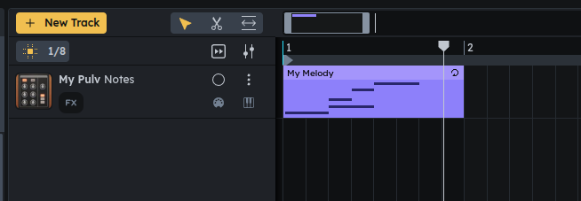

# Deno example

This example shows how to use the SDK using deno.

It uses `package.json` for now to allow installing the package via `.tgz`.

How to run:

- [install deno](https://docs.deno.com/runtime/getting_started/installation/)
- call `deno i`
- go to [beta.audiotool.com](https://beta.audiotool.com/), log in
- go to [rpc.audiotool.com/dev/pats](https://rpc.audiotool.com/dev/pats/), create a PAT
- crate a .env file with the following contents:
    ```
    AT_PAT=at_pat_your_token_here
    AT_PROJECT="https://beta.audiotool.com/studio?project=your-project-here"
    ```
- run with `deno run x`, where x is one of:
    - `current-state`
    - `react-to-changes`
    - `write-melody`


### Caveat:
After `nexus.start()` has been called, there's currently no way to `stop` it, meaning the process has to to be killed with Ctrl + C. This is being worked on.


## Example 1: `get-current-state.ts`

Reads the current state of a project, prints out all notes, organized by note regions.

Example: This project:



outputs:


```
> deno run current-state
Task current-state deno run --allow-env  --allow-net --env-file=.env get-current-state.ts
Nexus connected.
Note Region 'Quick Notes' has notes:
┌───────┬──────────┬───────┬──────────┐
│ (idx) │ position │ pitch │ duration │
├───────┼──────────┼───────┼──────────┤
│     0 │ 1440     │ 61    │ 120      │
│     1 │ 480      │ 65    │ 120      │
│     2 │ 0        │ 60    │ 120      │
│     3 │ 960      │ 68    │ 120      │
│     4 │ 240      │ 61    │ 120      │
│     5 │ 480      │ 69    │ 120      │
└───────┴──────────┴───────┴──────────┘
Note Region 'Long Notes' has notes:
┌───────┬──────────┬───────┬──────────┐
│ (idx) │ position │ pitch │ duration │
├───────┼──────────┼───────┼──────────┤
│     0 │ 0        │ 63    │ 2040     │
│     1 │ 0        │ 67    │ 2040     │
│     2 │ 0        │ 60    │ 2040     │
└───────┴──────────┴───────┴──────────┘
```


## Example 2: `react-to-tchanges.ts`

This example reacts to changes of a note region. Example output:

```
crated region with name: Notes at position: 0
note created in region with name: Notes
renamed region from Notes to Hello There
moved region with name: Hello There
resized region with name: Hello There to size: 11520
note created in region with name: Hello There
note created in region with name: Hello There
note removed from region with name: Hello There
note removed from region with name: Hello There
note removed from region with name: Hello There
removed region with name: Hello There
```


## Example 3: `write-melody.ts`

In this example we create a new note track from scratch and write a melody into it:

