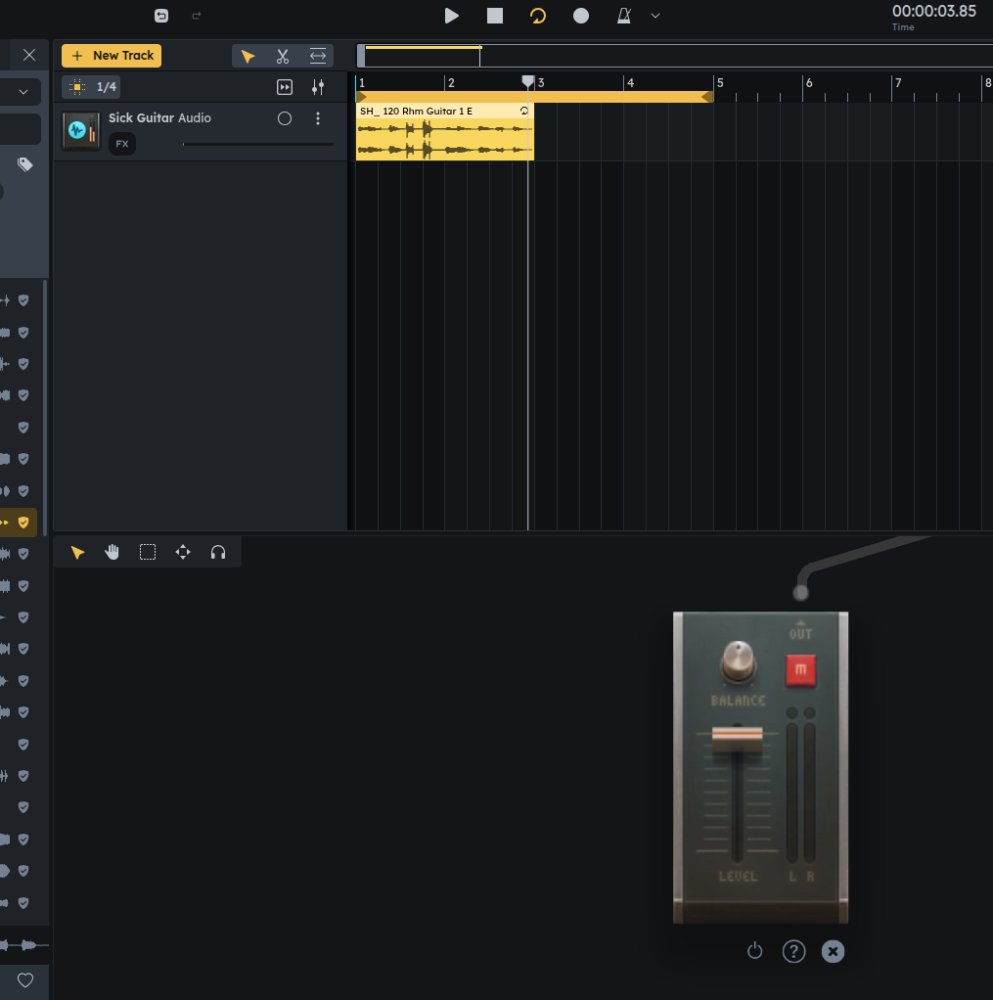

# Sample Download Example

In this example, we show how to fetch samples from the samples api using
the API object.

We start with a project like this:

and then:

- query for all audio regions
- extract the sample entity from all audio regions
- go to the sample API to get flac, wav, mp3 urls
- download the sample, list it, & play it

And end up with a page that allows us to play the samples in the audio regions:

