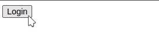
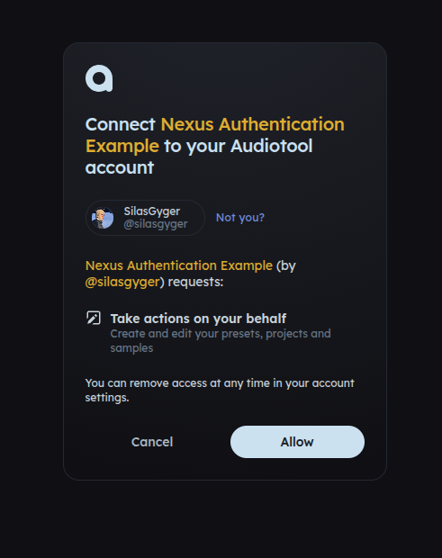
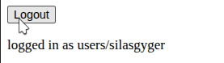
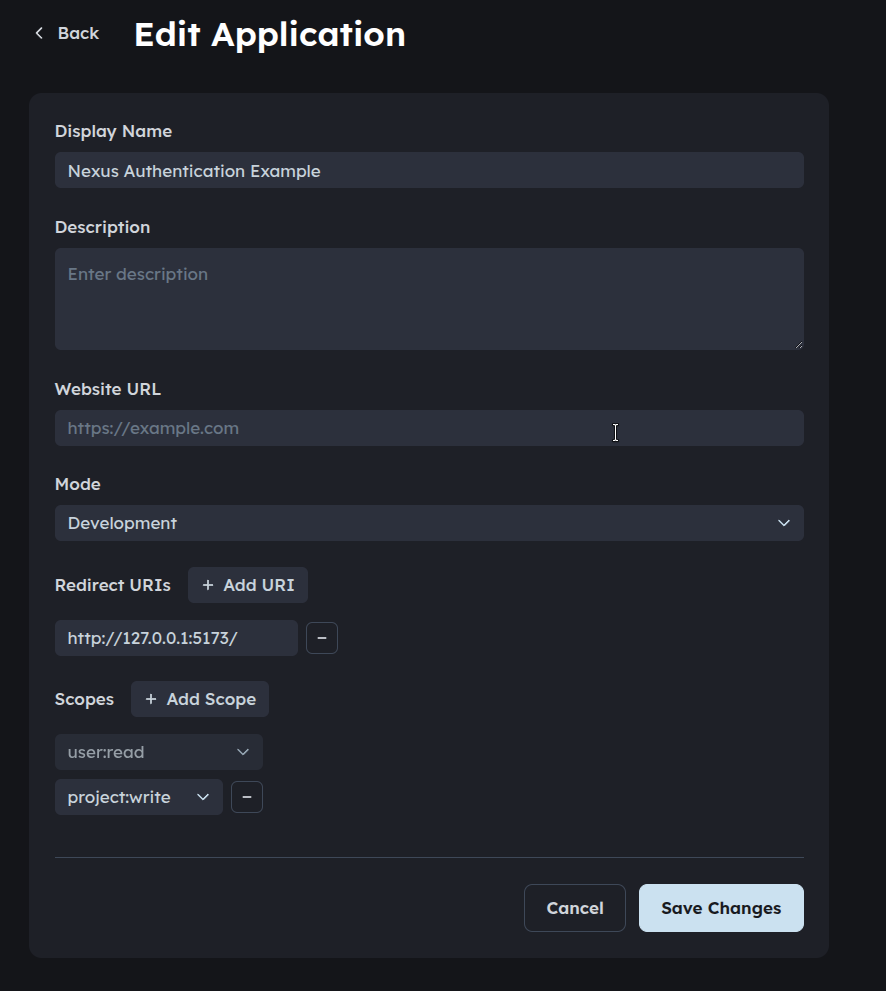

# Login Flow Example

**Accompanying Docs: [Login](https://developer.audiotool.com/js-package-documentation/documents/Login.html)**

This example shows how to connect your users using a login flow so users see a
login button they can press:

which will redirect them to this:

and return them to your app - now showing this:

The configuration for the app used in this example (done [here](https://developer.audiotool.com/applications)) is as follows:

